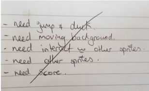

# README

## Initial BrainStorming Ideas on which App we will do

### Google Translate

we first considered getting an API from google to create a google translator. The user could input what language they wanted to translate to and from, input their sentence they wanted translated and the app would spit out the answer.

Further features included bringing up a flag of the language they wanted with the translated sentence. Perhaps bringing up iconic pictures of the country and further even having google speak out the sentence so the user could hear the translation.

This idea was ultimately rejected because the initial idea of using the API, user inputs and the app spits out the answer sounded like it would be about 10 lines of code all up. Not exactly the best thing when the whole idea of the assignment was to write classes/modules etc etc

### Tetris

This idea we both liked! We pondered on it for a while – how we would draw up the screen. How we would draw the pieces. How we would rotate the pieces – which part of the piece is the pivot point? How the pieces would sense other pieces and lock into place at the bottom. How the lines at the base would know they are complete and disappear and everything drops…. Ultimately it sounded like a really fun idea, but certainly not one we could pull off in such a small amount of time.

### Dino-eske Game

A game similar to the dinosaur one you get with google (as seen [here][dinogame]) At the start of the game you could choose your character/theme. We considered scanning in hand drawn characters so we could make them look like us in cartoon form and be collecting our fav foods like burgers or pizza. Other characters included the Cookie Monster and he’d be collecting cookies. Mario could collect coins etc.

The character would need a few sprites drawn – two for walking/running that we could toggle between to give the impression of walking. One sprite to jump and one to duck.

The background would be set to move in an autorun style, while the player seemingly stays in the same spot. The player would need to jump at appropriate times to collect food/gems/coins etc, also jump and duck to avoid being hit by things that could harm them.

As the time went by the speed of the screen would slowly increase making it harder and harder. We were also thinking about a feature of having extra lives and powerups.

This idea was ultimately rejected because Jo’s computer didn’t like the gems that were required (either gosu or Ruby 2D). Jamie found a way around it but it ultimately slowed the computer a lot and didn’t seem worth the hassle.

### Trip Planner app

An app where the user would input what station they wanted to get on the train and what station they wanted to get off the train. It would also ask for the users current address.

The app would use APIs to talk to CityRail TripPlanner and find the next 5 times a train matching those results was leaving. The app would also use an API to talk to google maps and find the amount of time it would take to walk to the station stated from the users current address. According to how much time until the train left and the amount of time the person would take to walk the app would tell you to either “forget about that train, it’s just not going to happen”, “you better run”, “walk briskly”, “you can probably just walk”, “you have time to dawdle”. We thought this would be really useful – the amount of times I’ve missed a train by 10seconds, and if I’d only known I had to walk a little faster!  Ultimately this idea was tossed cause it sounded really complicated and we weren’t sure if we’d have the time to pull it off.

### Other ideas

other that were considered briefly but tossed for various reasons were a music player, something much like frogger, “teach me how to code” type 2D platformer game, something like Mario and a water drinking tracker.

## Brainstorming for our chosen app

Ultimately we chose by David choosing his top 3 favourite ideas from all of them and Jo picking her favourite from those 3.
We ultimately settled on mazes after much ado with the gems and Jo’s computer. They seemed challenging enough to be worth doing, but not so easy that we’d be done in one afternoon. Our idea started as “let’s generate a random maze then the player can go through the maze”. Upon completion another maze would generate. The user could continue to play as long as they wanted.
After looking into maze generating algorithms we decided that was batting way out of our league, so we decided to hardcode the mazes.  Further brainstorming ideas are found below in our “expansion pack”

### User Story (original)

- User begins game
- Welcome message + are you ready to play?
- User hits yes
- Timer starts
- User sees map of maze 1 and navigates through it.
- A line is drawn to show where user has gone
- At end of each level timer stops, high scores are shows for that level and get a congrats message shown. If high score user can enter their name. Times are written to a file to be retrieved later so scores are kept. Keep top ten high scores
- Next level starts and repeat

### User Story (actual)

- User begins game
- Welcome message and instructions displayed
- Game starts
- User sees maze with car at one end and puppy at the other, and navigates through it
- At end of the maze a congrats message is shown.
- Game ends
- If at any point the player hits ‘q’ the game ends with ‘game over’ message

Here we can see the flow of what is going on in the game. Get input from the user in way of a direction with the arrow keys – up, down, left or right.

Is that spot in that direction actually free to move into? If it isn’t then get another direction.  If it is, then move there. From there has the player reached the end of the maze? If yes then show a congratulations screen and end the game. If not get another direction. Repeat as needed.

Here are some further scribblings of our brainstorming sessions. One our initial brainstorming ideas on features and thoughts in general. The other a list of things we need to work on plus further detail on the algorithms needed for controls and writing the high scores to a file.

## https://github.com/Rainbow-Ninja/TerminalApp

## Purpose of the app

aMazing is an app purely for enjoyment. The user is a little car that has to find its way home, through a maze, to their puppy.

## Functionality

As it stands there is one level in aMazing where the user can work their way through the maze using the arrow keys. Upon completion a congratulatory message is shown. The user can press ‘q’ at any time (once the actual game starts) to end the game.
Further features that were made but unable to get to work:

- A timer that would aid in part to calculate the users score (score would be 100 – time + points if user collected randomly generated powerups along the way)
- High score stored in a text file. At the completion of the game if the user had beaten one of the top ten scores they are asked to enter their name. The top 10 scores are then displayed

Further features to add in the future i.e. the Expansion Pack:

- Add levels – upon completion of the board the player resets back to the start of a new maze to begin again. Levels become increasingly more difficult (larger, more involved mazes)
  - This was actually attempted. Up to four levels have been made, however linking them up never quite happened. Attempts were made but ultimately we ran out of time
- Add difficulty settings – easy mode would leave a line behind you to see where you have already gone. Hard mode has no line
  - This would be an easy enough feature to add in theory. Instead of writing nothing where the player icon just was, you would draw a “.” The main reason this was not added is it would also require a load in page at the start of the game to choose which mode. Again time restraints
- Be able to choose your character – boy, girl, car or animal etc
  - This would actually be similar to choosing difficulty settings in that it would just be a simple switch of icon. Similarly to difficulty settings it would also involve a load in page to choose and time did not allow.
- Capture the date and allow extra characters to be used on special dates eg Santa for the week around Christmas, a pumpkin for Halloween, a clover for St. Patricks day and so on
  - This was a little more involved but still a relatively simple fix. Capturing the date from the computer and comparing it to preset dates we would determine. Based on that the load in screen where choosing characters would come up would display extra characters or not. Again time did not allow for this feature
- Random “candies” that pop up in the maze that would give extra points if managed to obtain them before completing the maze
  - These candies may or may not have been random (perhaps preset positions but not displayed until a set time). The candies could match the theme the user has previously chosen, for example if you chose to be cookie monster a cookie would pop up in the maze. Maybe pizza or burgers would pop up for a boy and girl. Or dog treats if you chose a dog. These would take you out of your way in the maze, slowing you down, but would ultimately add to your points. The user has to decide of the setback in time is worth the points gained. Once again time made us shelf this idea.

## The Game as it is

We start with a welcome screen. Here is a screencap of the welcome message to the game aMazing. It loads by “caching” and line by line, very retro 80’s style, each part of it is revealed to form the entire welcome message. It sits for a few seconds before moving onto the instructions.

Momentarily after the welcome message the instructions will appear and remain on the screen for 7 seconds. We figure that’s enough time for people to read it without being too long.

From there the first (and only, at this stage) board is loaded. You are in the top left of the maze as the little car. Your puppy awaits you in the bottom right. You must navigate through the maze to your puppy

Upon completing the maze you are met with a coloured “sparkling” bandana. The stars
appear to flash different colours and you get your cuddles.

Finally if you decide to quit the game for any reason you will see this message:

## Project Plan and TimeLine

Our timeline did get blown out thanks to the initial gem problem. That ate about half of our first day before we decided to change ideas.

### Day 1

- Get inputs working and draw up several levels of mazes – that’s about the extent of what we had time for after all the mess.

This was a bulk of our coding done in the first day as far as actual functionality. Nothing was connected yet and the app didn’t work as a whole but the inputs were there, the maze boards were there, now we just needed things to talk.

- Look into any gems we may need

As it stands we didn’t use any (we have added colour but we just added the code rather than the gem)

### Day 2

- Create timer, congratulations message, welcome screen, and connect all the files together. Refine what we had. Would like to have the bulk of the actual coding done by now. Anything not mostly finished at this point gets added to the expansion pack.

Most things were coded at this point. It was later thought to add a proper welcome message and instructions too. A lot of code was refined and shifted just to make it all neater.

- Also start putting together documentation
Started some very rough documentation – got screenshots and put it all in a rough word doc to be cleaned up later

### Day 3

- Mostly documentation. README file, screenshots, testing of game
All completed as planned

### Day 4

- Work on presentation. Proofread all documentation and refine as necessary. Any last minute changes to the game (not advised but if there are any sudden “aha!” moments by all means add it).

- Zip everything up and submit

**Trello board** with a large amount of things done:

Trello right near the end. Some things still left as features.

Trello board on the day before everything is due. There is no longer anything on the “to do” list. Features that are just not going to be finished have been added to the expansion pack. Everything else is either done and being done.

## Game Testing

Feature | What it is | Expected Outcome | Actual Outcome | Is it a problem?
--- | --- | --- | --- | ---
**Welcome screen** | An ASCII drawing of the name of the game | ASCII art of title of the game should “load” slowly in a retro 80’s style | As expected | No
**What happens if I hit keys during welcome message?** | --- | Nothing should happen | The keys are printed to the screen in the position of the cursor at the time | Kind of annoying, ruins the ASCII art, but not really a problem
**Instruction screen** | A quick blurb on what the game is and how to control your character | Instructions of what the game is and how to play should be held on the screen for 7 seconds | As expected | No
**What happens when I hit keys during the instructions** | --- | Nothing should happen | The keys are printed to the screen under the instructions | Kind of annoying, but not a problem
**Prints map** | Refresh the map each move | The maze reprints with each move moving the appearance of movement | As expected | No
**Car controls left** | Arrow key to move left | Car should move left as long as the space to the left is clear | As expected | No
**Car controls right** | Arrow key to move right | Car should move right as long as the space to the right is clear or if the space to the right is the puppy | As expected | No
**Car controls up** | Arrow key to move up | Car should move up as long as the space up is clear | As expected | No
**Car controls down** | Arrow key to move down | Car should move down as long as the space down is clear | As expected | No
**What happens if I hit ‘esc’** | --- | Nothing should happen | As expected | No
**What happens when I hit a key other than the arrows in play** | --- | Nothing should happen | As expected | No
**Try to drive through wall horizontally** | --- | Car should not move | As expected | No
**Try to drive through wall vertically** | --- | Car should not move | As expected | No
**What happens when I hit the end point** | --- | Congratulations message should come up then the game exits | As expected | No
**What happens when I hit ‘q’** | --- | “Thanks for playing. Game over” should appear then game exits | As expected | No
**Congrats msg** | --- | At end of maze a banner of “flashing stars” should appear with a “congrats” message between them | As expected | No
**What happens after the congrats message** | --- | Game should exit | As expected | No

[dinogame]: https://apps.thecodepost.org/trex/trex.html